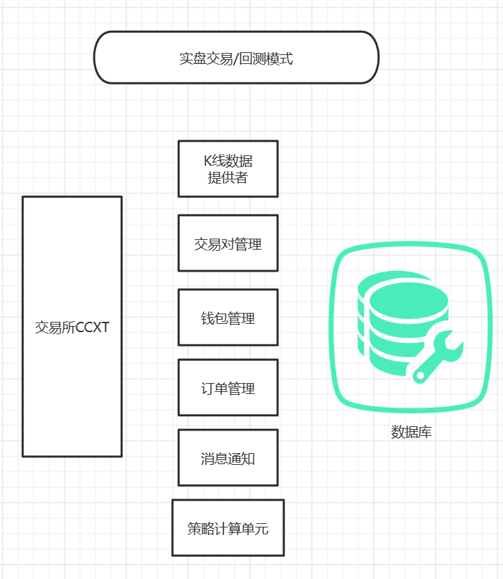

# 技术选型
请参考[底层架构说明](sys_structure.md)  
目前一个机器人一个进程，只能对一个交易所的一个市场下所有交易对进行交易。  
如果需要同时交易多个交易所或多个市场，请启动多个机器人，或修改项目源码。  

# 主要项目架构
## 系统各部件组成

## 目录结构说明
**cmds**: 从命令行启动程序的入口，提供了`trade`, `backtest`, `down_data`, `dbcmd`, `od_compare`命令  
**main**: 机器人主启动逻辑。  
**main/live_trader.py**: 启动实时机器人，两种运行模式：实盘模式、实时模拟  
**main/od_manager.py**: 订单管理组件。包含回测订单管理器、实时订单管理器。

**optmize**: 回测和优化相关。  
**optmize/backtest.py**: 回测模式启动机器人。

**compute**: 策略信号计算部分，提供了向量计算和带状态计算两种方式。向量计算即给定300个bar一次性计算完返回；带状态计算即每个bar计算一次，下次计算时能复用上次的状态。
向量计算方式适合回测，针对大量数据一次性快速计算完成，能充分利用CPU性能。但不适合实时交易系统，每个bar每分钟到来一次，每次计算时都要把前面的数据再计算一遍。
带状态计算适合实时交易系统，只针对最新bar，计算需要的部分，性能更好。在回测时也需要逐个bar计算，大数据量下性能差于向量计算  
**config**: 应用配置、配置读取。在启动时通过指定`-c`参数传入配置文件的绝对路径，可同时传入多个`-c`配置文件，后面的会更新前面的。
可以把不含敏感信息的公共配置写到`config.json`，把包含交易所key和secret的部分写到`config.local.json`中，然后使用两个配置一起启动机器人。  

**data**: K线数据处理部分。
**data/feeder.py**: 交易对数据反馈器。一个Feeder：某个交易所、某个市场、某个交易对的数据。如果需要多个周期，则自动从小周期聚合为大周期数据。
如币安现货BTC/USDT的1m，5m，15m数据，都可以用一个Feeder来提供。  
**data/provider.py**: 机器人K线数据提供者。一个Provider：某个交易所、某个市场的所有交易对数据。  
**data/spider.py**: K线数据爬虫。爬虫可单独启动（尚未提供命令行），也可随机器人启动。  
一个爬虫可同时爬取多个交易所、多个市场、多个交易对的数据。一个爬虫爬取的数据可同时供多个机器人使用。  
爬虫和机器人通过redis的订阅分发机制通讯，一个爬虫发消息到redis，多个机器人可监听消息消费。  
**data/tools.py**: K线数据帮助函数。`auto_fetch_ohlcv`用于获取指定交易所、指定市场、指定交易对的数据，如不存在则自动下载。  
**data/watcher.py**: 一些细节基类。其中`KlineLiveConsumer`是机器人和网站端使用的从redis监听爬虫推送数据的消费端。  

**exchange**: 交易所部分。使用ccxt类库，支持上百个交易所。    
`get_exchange(exg_name, market)`是获取指定交易所、指定市场的ccxt交易所对象的函数。两个参数都可选，不提供时从配置文件读取。  

**rpc**: 机器人消息通知。目前支持下单时企业微信消息通知。  

**storage**: 数据库存储和访问主要逻辑。
**storage/base.py**: 数据库存储访问的基类和若干帮助函数。  
**storage/bot_task.py**: 机器人启动任务。每次启动机器人都对应一个任务。用于管理对应的数据库订单记录。  
**storage/klines.py**: K线数据存储和访问。基于timescaledb  
**storage/orders.py**: 数据库订单的存储访问
**storage/symbols.py**: 交易对管理。

**strategy**: 交易策略部分。  
**strategy/base.py**: 交易策略基类，自行实现的所有策略都需要从基类继承。  
策略使用带状态的信号计算，内置了若干指标公式。回测和实盘使用一套策略代码。   

**symbols**: 交易对管理。每次机器人启动可同时处理多个交易对。  

